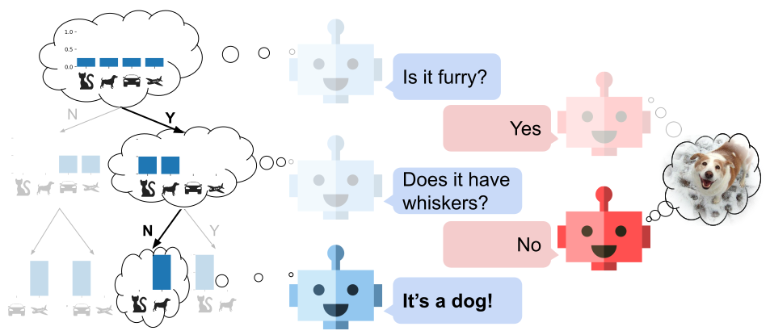

# Learning Decision Trees Recurrently Through Communication
This is the official PyTorch code for our CVPR 2021 paper on Learning Decision Trees Recurrently Through Communication. It allows training and testing of our RDTC and aRDTC models on [Animals with Attributes 2 (AWA2)](https://cvml.ist.ac.at/AwA2/) [1] and [CUB-200-2011](http://www.vision.caltech.edu/visipedia/CUB-200-2011.html) [2] datasets.



## Installation
We provide model checkpoints of the pre-trained CNN backbones for AWA2 and CUB. Since these models are stored with `git lfs`, make sure you have [git lfs](https://git-lfs.github.com/) installed prior to cloning the repository.
All Python dependencies can be installed into a conda environment with the provided environment.yml file.

1. Clone the repository
```shell
git clone https://github.com/ExplainableML/rdtc.git
cd rdtc
```
2. Create conda environment
```shell
conda env create -f environment.yml
```
3. Activate environment
```shell
conda activate rdtc
```
4. The script `./download_data.sh` downloads and preprocesses both AWA2 and CUB into `./data`

## Usage
The following commands are examples for training the model. To see all possible parameters, use `python main.py --help`. By default, a taining run saves logs into `./log` including model checkpoints and tensorboards.

### RDTC
* Train RDTC on AWA2 learning 256 binary attributes
```
python main.py --name rdtc_awa2 --dataset awa2 --use-pretrained --attribute-size 256 --attribute-coef 0.
```

* Evaluate latest checkpoint on test set with pruning (stop tree rollout when confidence > 0.95)
```
python main.py --dataset awa2 --eval ./log/rdtc_awa2/latest.pth --attribute-size 256 --attribute-coef 0. --threshold 0.95
```

### aRDTC
* Train aRDTC on CUB with `lambda = 0.2` (attribute-coef) and maximum tree depth of 25
```
python main.py --name ardtc_cub --dataset cub --use-pretrained --attribute-coef 0.2 --max-iters 25
```

* Evaluate best checkpoint (according to validation) on test set without pruning
```
python main.py --dataset cub --attribute-coef 0.2 --max-iters 25 --eval ./log/ardtc_cub/best_clsacc.pth --threshold 1.
```

## Citation
If you use this code, please cite
```
@inproceedings{alaniz2021rdtc,
  title = {Learning Decision Trees Recurrently Through Communication},
  author = {Alaniz, S. and Marcos, D. and Schiele, B. and Akata, Z.},
  booktitle = {IEEE Conference on Computer Vision and Pattern Recognition (CVPR)},
  year = {2021}
}
```

## References
1. Y. Xian, C. H. Lampert, B. Schiele, Z. Akata. "Zero-Shot Learning - A Comprehensive Evaluation of the Good, the Bad and the Ugly", IEEE Transactions on Pattern Analysis and Machine Intelligence (T-PAMI) 40(8), 2018.
2. C. Wah, S. Branson, P. Welinder, P. Perona, S. Belongie, "The Caltech-UCSD Birds-200-2011 Dataset." Computation & Neural Systems Technical Report, CNS-TR-2011-001, 2011.
